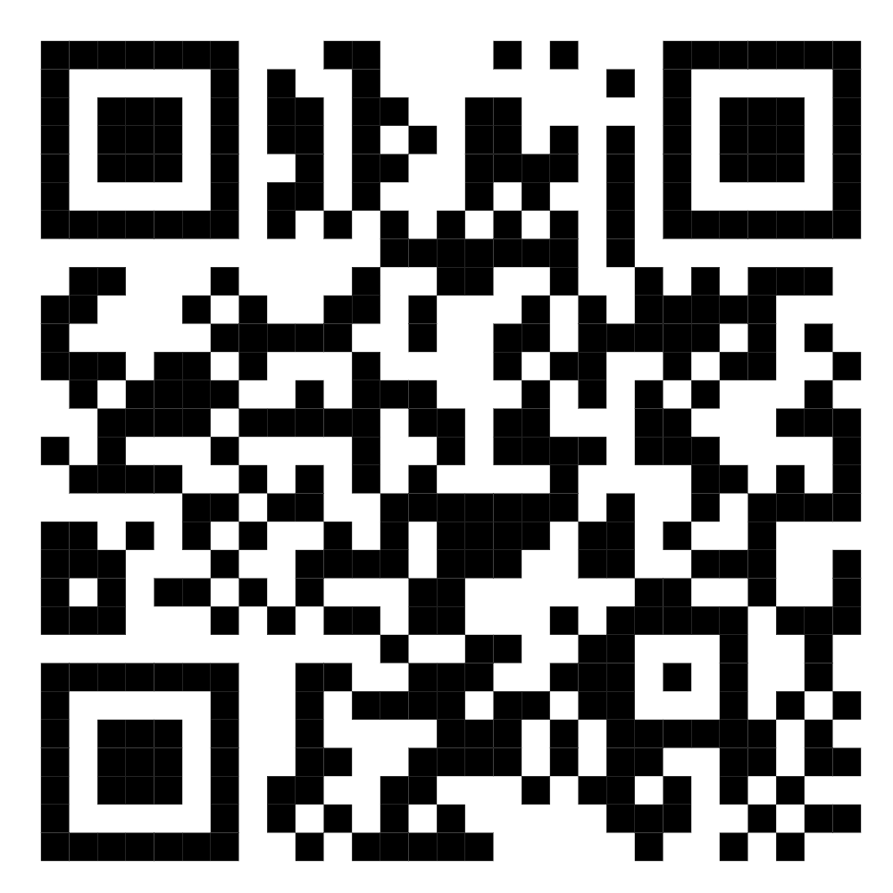
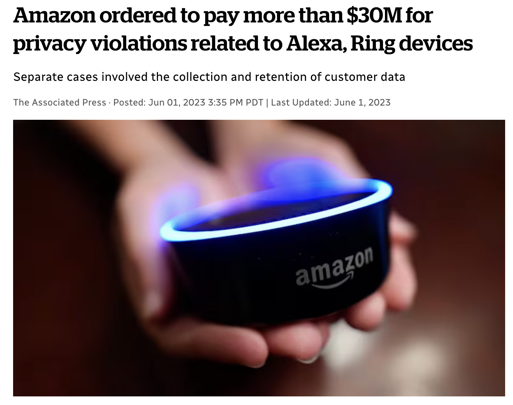
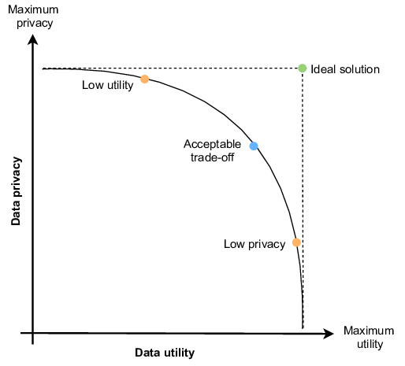
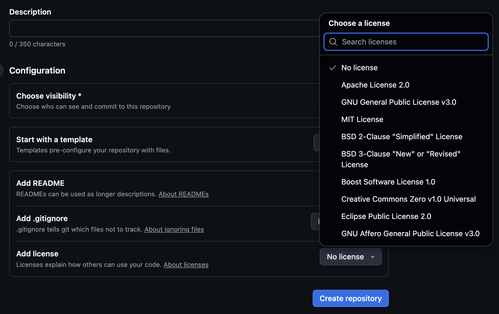

## About Me

::::: {style="display: flex; flex-direction: column; align-items: center; gap: 1.5rem;"}
::: {style="display: flex; gap: 3rem; justify-content: center;"}
```{=html}

```

```{=html}

```
:::

::: {style="text-align: center; font-size: 1.2em;"}
**Katie Burak**\
Assistant Professor of Teaching, Department of Statistics, UBC <https://katieburak.github.io/>
:::
:::::

## 



<https://katieburak.github.io/torus-talk-2026/>

## What Are You Comfortable Sharing?

::: column
-   Your favourite type of music\
-   Your Instagram likes and follows\
-   Your e-mail\
-   Your name and DOB\
-   Your GPS location throughout the day
-   Your browsing history
-   Your private messages/DMs\
:::

:::: column
::: incremental
-   Which of these data would you feel comfortable sharing with an app?\
-   What if it combined two or three pieces of information?
:::
::::

## 

-   Even something as simple as your Facebook "likes" can reveal a lot more than you think...
-   Researchers at Cambridge showed that algorithms could predict:
    -   Sexual orientation with up to 88% accuracy
    -   Race with 95% accuracy
    -   Political affiliation with 85% accuracy
-   All from analyzing the pages and posts you "liked" (no profile bio or messages needed)!

> [*https://www.cam.ac.uk/research/news/digital-records-could-expose-intimate-details-and-personality-traits-of-millions*](https://www.cam.ac.uk/research/news/digital-records-could-expose-intimate-details-and-personality-traits-of-millions){.uri}

## What Happens to Your Data?

Every time you use an app, visit a website, click on a link, fill out a survey or even just scroll on your device, your data is being:

::: incremental
-   Collected 
-   Analyzed 
-   Shared or Sold
:::


------------------------------------------------------------------------

## Why Does This Matter?

-   You may be targeted with ads, content and potentially misinformation
-   You could be judged or profiled based on your data
-   You don't always know who has your data (or what they’re doing with it)

{width="600px" style="display:block; margin-left:auto; margin-right:auto;"}

::: {style="font-size: 0.6em; text-align: center; color: gray;"}
Source: <a href="https://www.cbc.ca/news/business/amazon-fine-alexa-ring-1.6862761" target="_blank">CBC News</a>
:::

## Personally Identifiable Information (PII)

-   PII refers to any data that can be used to identify a specific individual.
-   Direct identifiers: These clearly and uniquely point to a person.
    -   Examples: name, social security number, patient ID
-   Indirect identifiers: These don’t identify someone on their own, but could when combined.
    -   Examples: age, DOB, postal code, race, sex

## Personal Data

Data can be identifiable when:

::: incremental
-   They contain directly identifying information
-   It's possible to single out an individual
-   It's possible to infer information about an individual based on information in your dataset
-   It's possible to link records relating to an individual
-   De-identification is still reversible
:::

## Scenario: Can This Data Identify You?

A fitness app shares anonymized data with researchers. The dataset includes:

-   Step count per day
-   General location (postal code)
-   Age
-   Time of day the user exercises
-   Health conditions

Separately, a publicly available dataset includes information from a local running club: names, age groups and 5K race times.

## The Mosaic Effect

-   The "Mosaic Effect" can happens when separate pieces of data, which alone don’t identify anyone, are combined from different sources to reveal personal information or identify an individual.

-   In 2000, 87% of the United States population was found to be identifiable using a combination of their ZIP code, gender and date of birth.

{width="600px" style="display:block; margin-left:auto; margin-right:auto;"}

> [*https://dataprivacylab.org/projects/identifiability/paper1.pdf*](https://dataprivacylab.org/projects/identifiability/paper1.pdf)

## Pseudonymization and Anonymization

-   Pseudonymization and anonymization are techniques to de-identify personal data
-   Goal: reduce linkability of data to individuals
-   We will now define each of these terms

## Pseudonymization

::: incremental
-   Reduces linkability of data to individuals
-   Data cannot identify individuals *without additional information*
-   Often done by replacing direct identifiers with pseudonyms
-   Link between real identifiers and pseudonyms is stored separately
-   Re-identification remains possible!
:::

## Anonymization

::: incremental
-   Data are anonymized when no individual is identifiable (directly or indirectly)
-   This applies even to the data controller
-   Fully anonymized data are no longer personal data
-   Anonymization is difficult to achieve in practice
:::

## Identifiability Spectrum

-   Identifiability is a spectrum
-   More de-identified data = closer to anonymized
-   Lower identifiability = lower re-identification risk


> [*https://www.kdnuggets.com/2020/08/anonymous-anonymized-data.html*](https://www.kdnuggets.com/2020/08/anonymous-anonymized-data.html)


# De-identification Techniques

## 

First, let's generate some (synthetic) data we can use to help illustrate these concepts.

```{r echo=TRUE}
library(tidyverse)

df <- tibble(
  name = c("Ada Lovelace", "Sophie Germain", "Carl Gauss", "Leonhard Euler"),
  age = c(36, 55, 61, 76),          
  height_cm = c(160, 173, 182, 185)  
)

df
```

## Suppression

::: incremental
-   Remove entire variables, values or records
-   Used to eliminate highly identifying or unnecessary data
-   Examples:
    -   Names, contact details, social security numbers
    -   GPS metadata, IP addresses, neuroimaging facial features
    -   Outliers or unique participants
:::

## Suppression Example

```{r echo=TRUE}
df_suppressed <- df |>
  select(-name)

df_suppressed
```

## Generalization

::: incremental
-   Reduces detail or granularity in the data
-   Makes individuals harder to single out
-   Examples:
    -   Convert date of birth to age, or group into ranges
    -   Replace address with town or region
    -   Recategorize rare labels into “other” or “missing”
:::

## 

Here we will show an example of generalization on the `age` column:

```{r echo=TRUE}
df_generalized <- df |>
  mutate(age_group = case_when(
    age < 60 ~ "under 60",
    TRUE     ~ "60+"
  ))|>
  select(-age)

df_generalized
```

## Replacement

::: incremental
-   Swap identifying info with less informative alternatives
-   Examples:
    -   Use pseudonyms for names (with securely stored keyfile)
    -   Replace with placeholders (e.g., “\[redacted\]”)
    -   Rounding numeric values
:::

## Creating Pseudonyms

::: incremental
-   Pseudonyms should reveal nothing about the subject
-   Good pseudonyms:
    -   Are random or meaningless strings/numbers
    -   Are securely managed (e.g., encrypted keyfile)
-   Can be generated using tools in Excel, R, Python, SPSS
:::

## Replacement with Pseudonyms

```{r echo=TRUE}
df_pseudonymized <- df |>
  mutate(pseudonym = paste0("ID", row_number())) |>
  select(pseudonym, everything(), -name)

df_pseudonymized
```

## Hashing

-   Hashing converts names into fixed-length, irreversible strings.
-   Unlike pseudonyms, hashed values cannot be easily reversed.
-   In R, we can use the `digest` package (and function) to hash.

## 

```{r echo=TRUE}
library(digest) 

df_hashed <- df |>
  rowwise() |>
  mutate(name_hash = digest(name)) |>
  select(name_hash, everything(), -name)

df_hashed
```

## Top- and Bottom-Coding

::: incremental
-   Limits extreme values in quantitative data
-   Recode all values above or below a threshold
-   Example: all incomes above \$150,000 become \$150,000
-   Preserves much of the dataset, but distorts distribution tails
:::

## Top-coding example

-   Suppose 6ft (182.88cm) is considered our maximum height threshold:

```{r echo=TRUE}
df_top_coded <- df |>
  mutate(height_cm = if_else(height_cm > 182.88, 182.88, height_cm))

df_top_coded
```

## Adding Noise

-   Introduces randomness to protect sensitive info
-   Examples:
    -   Add a small random amount to numeric values
    -   Blur images or alter voices

## Adding Noise to Height

```{r echo=TRUE}
set.seed(200) 

df_noisy <- df |>
  mutate(height_cm_noisy = height_cm + rnorm(n(), mean = 0, sd = 2)) |>
	select(-height_cm)

df_noisy
```

## Permutation

::: incremental
-   Swap values between individuals
-   Makes linking variables across a record more difficult
-   Maintains distributions, but breaks correlations
-   Can limit the types of analyses possible
:::

## Permutation of Height Values

```{r echo=TRUE}
set.seed(200)

df_permuted <- df |>
  mutate(height_cm_permuted = sample(height_cm)) |>
	select(-height_cm)

df_permuted
```

## Privacy vs. Utility Tradeoff



> [*https://www.researchgate.net/figure/Trade-off-between-privacy-level-and-utility-level-of-data_fig1_357987903*](https://www.researchgate.net/figure/Trade-off-between-privacy-level-and-utility-level-of-data_fig1_357987903)

## Case Study: Brogan Inc. and NIHB Data

-   The Non-Insured Health Benefits (NIHB) database contains sensitive health data on First Nations use of services like prescriptions, dental care, and medical devices.
-   In 2001, Health Canada began releasing de-identified NIHB pharmacy claims data to Brogan Inc. (a private health consulting firm).
-   Though personal identifiers were removed, community identifiers remained, and First Nations were not informed until 2007.
-   Brogan sold the data to pharmaceutical companies for commercial research and marketing
-   Health Canada justified the release by claiming no privacy interests remained since personally identifying information had been removed.

> Kukutai, T., & Taylor, J. (2016). Indigenous data sovereignty: Toward an agenda. ANU press.

## Discussion

-   What are the limits of simply removing names and IDs from a dataset?
-   How can we measure whether a dataset is truly “safe” to release?
-   Should de-identified data still require community consent before being shared or sold?

## Why basic deidentification isn't always enough

-   Individuals can often be re-identified using other information.

-   As datasets become more detailed and linkable, privacy risks increase.

-   De-identification may protect individuals but not groups and even “anonymous” data can reveal sensitive patterns about communities.

-   More advanced statistical methods are often needed to ensure meaningful deidentification while preserving data utility.

## Statistical approaches to deidentification

<br></br>

-   $k$-anonymity\
-   $l$-diversity\
-   Differential privacy (advanced)

## Overview of privacy models

-   $k$-anonymity and $l$-diversity are **statistical approaches** that quantify the level of identifiability within a tabular dataset.\
-   They focus on how variables combined can lead to identification.\
-   They work best on relatively large datasets, where enough observations are present to preserve useful detail while still protecting privacy.

## Identifiers, Quasi-Identifiers, and Sensitive Attributes

Privacy models distinguish between three types of variables:

::: incremental
-   **Identifiers:** Direct identifiers such as names, student numbers, email addresses.

-   **Quasi-Identifiers:** Indirect identifiers that can lead to identification when combined with other quasi-identifiers or external data.

    -   Examples: age, sex, place of residence, physical characteristics, timestamps, etc.

-   **Sensitive Attributes:** Variables of interest that need protection and cannot be altered as they are key outcomes.

    -   Examples: Medical condition, Income, etc.

-   Correctly categorizing variables into identifiers, quasi-identifiers, and sensitive attributes is crucial in determining how to de-identify your dataset effectively.
:::

## $k$-anonymity

::: incremental
-   A data set is $k$-anonymous if each observation cannot be distinguished from at least $k-1$ other observations based on the quasi-identifiers.\
-   This can be achieved through generalization, suppression and sometimes top- or bottom-coding of data values.
-   Applying $k$-anonymity makes it more difficult for an attacker to single out or re-identify specific individuals.\
-   It also helps reduce the risk of the mosaic effect, where combining data points could lead to identification.
:::

## Making a data set $k$-anonymous

::: incremental
1.  Identify variables as identifiers, quasi-identifiers and sensitive attributes.\
2.  Choose a value for $k$.\
3.  Aggregate or transform the data so each combination of quasi-identifiers occurs at least k times.\
:::

## Choosing $k$

-   There is no single correct value for $k$!
-   Higher $k$ increases privacy, but reduces data detail and utility.\
-   The choice depends on promises made to data subjects and acceptable risk levels.

::: {style="text-align: center;"}
{width="600px"}

<small> Source: <a href="https://www.k2view.com/blog/what-is-k-anonymity" target="_blank">k2view.com</a> </small>
:::

## Example data

-   Age and city are quasi-identifiers, and salary is considered a sensitive attribute.

| Age | City      | Salary  |
|:----|:----------|:--------|
| 38  | Calgary   | 90,000–99,999  |
| 37  | Toronto   | 90,000–99,999  |
| 31  | Vancouver | 80,000–89,999    |
| 48  | Calgary   | 110,000–119,999  |
| 39  | Vancouver | 110,000–119,999  |
| 37  | Calgary   | 90,000–99,999   |
| 34  | Toronto   | 90,000–99,999   |
| 33  | Vancouver | 80,000–89,999   |
| 32  | Toronto   | 100,000–109,999|
| 45  | Calgary   | 90,000–99,999  |

## $k=2$

::: {style="font-size:0.65em"}
| Age Range | City      | Salary Range    |
|-----------|-----------|-----------------|
| 30–39     | Calgary   | 90,000–99,999   |
| 30–39     | Toronto   | 90,000–99,999   |
| 30–39     | Vancouver | 80,000–89,999   |
| 40–49     | Calgary   | 110,000–119,999 |
| 30–39     | Vancouver | 110,000–119,999 |
| 30–39     | Calgary   | 90,000–99,999   |
| 30–39     | Toronto   | 90,000–99,999   |
| 30–39     | Vancouver | 80,000–89,999   |
| 30–39     | Toronto   | 100,000–109,999 |
| 40–49     | Calgary   | 90,000–99,999   |
:::

## 

Given the data and treating condition as the sensitive attribute, which field(s) could you generalize to help achieve $k = 3$ anonymity?

::: {style="font-size:0.65em; max-width: 400px; margin: auto;"}
| Age | ZIP Code | Condition |
|-----|----------|-----------|
| 29  | 13053    | Flu       |
| 27  | 13068    | Flu       |
| 28  | 13068    | Cold      |
| 45  | 14853    | Diabetes  |
| 46  | 14853    | Diabetes  |
| 47  | 14853    | Cancer    |
:::

-   A. Generalize Age into age ranges (e.g., 20–29, 40–49)\
-   B. Suppress Condition entirely\
-   C. Generalize ZIP Code to first 3 digits (e.g., 130, 148)\
-   D. Generalize Age into age ranges (e.g., 20–29, 40–49) and ZIP code to first 3 digits (e.g., 130, 148)\
-   E. It's already $k=3$ anonymous

## 

::: {style="font-size:0.7em; max-width: 400px; margin: auto;"}
| Age   | ZIP Code | Condition |
|-------|----------|-----------|
| 20–29 | 130      | Flu       |
| 20–29 | 130      | Flu       |
| 20-29 | 130      | Cold      |
| 40–49 | 148      | Diabetes  |
| 40–49 | 148      | Diabetes  |
| 40–49 | 148      | Cancer    |
:::

## $l$-diversity

-   But what if all individuals within a group share the same sensitive value?

| Age Range | ZIP | Condition |
|-----------|-----|-----------|
| 20–29     | 130 | Flu       |
| 20–29     | 130 | Flu       |
| 20–29     | 130 | Flu       |

-   $l$-diversity is an extension of $k$-anonymity that ensures sufficient variation in a *sensitive attribute*.

## 

-   Although these data are $2$-anonymous, we can still infer that any 30-39 year old from Calgary who participated earns between 90-99k.

::: {style="font-size:0.65em"}
| Age Range | City      | Salary Range    |
|-----------|-----------|-----------------|
| 30–39     | Calgary   | 90,000–99,999   |
| 30–39     | Toronto   | 90,000–99,999   |
| 30–39     | Vancouver | 80,000–89,999   |
| 40–49     | Calgary   | 110,000–119,999 |
| 30–39     | Vancouver | 110,000–119,999 |
| 30–39     | Calgary   | 90,000–99,999   |
| 30–39     | Toronto   | 90,000–99,999   |
| 30–39     | Vancouver | 80,000–89,999   |
| 30–39     | Toronto   | 100,000–109,999 |
| 40–49     | Calgary   | 90,000–99,999   |
:::

## $l$-diversity

-   The approach requires at least $l$ different values for the sensitive attribute within each combination of quasi-identifiers.
-   Again, there is no perfect value for $l$ (typically $1< l \leq k$).

## 

-   With $l=2$, that means that for each combination of Age Range and City, there are at least 2 distinct Salary Ranges.

::: {style="font-size:0.65em"}
| Age Range | City    | Salary Range    |
|-----------|---------|-----------------|
| 30–39     | \-      | 90,000–99,999   |
| 30–39     | \-      | 90,000–99,999   |
| 30–39     | \-      | 80,000–89,999   |
| 40–49     | Calgary | 110,000–119,999 |
| 30–39     | \-      | 110,000–119,999 |
| 30–39     | \-      | 90,000–99,999   |
| 30–39     | \-      | 90,000–99,999   |
| 30–39     | \-      | 80,000–89,999   |
| 30–39     | \-      | 100,000–109,999 |
| 40–49     | Calgary | 90,000–99,999   |
:::

## There are still issues...

-   Even though the data is de-identified, some sensitive patterns can still leak through.

-   In the example we discussed, both individuals are grouped into the same age range and city.

-   While they are in different salary ranges and exact values are hidden, the range is still quite narrow.

-   Due to the similarity of the salary ranges, one can still infer that both individuals earn between \$90,000 and \$119,999.

::: {style="font-size:0.65em"}
| Age Range | City    | Salary Range    |
|-----------|---------|-----------------|
| 40–49     | Calgary | 110,000–119,999 |
| 40–49     | Calgary | 90,000–99,999   |
:::

## Differential privacy

-   So, we may need more sophisticated tools to privatize our data...
-   Differential privacy is a mathematical approach to protecting privacy
-   It ensures algorithm results are nearly the same whether one person’s data is included or not
-   Differential privacy makes it hard to tell if any individual’s data is in the dataset, which protects individual's information (even with unusual or unique data)

## 

<center>


<br>

[Source: <a href="https://medium.com/data-science/a-differential-privacy-example-for-beginners-ef3c23f69401">https://medium.com/data-science/a-differential-privacy-example-for-beginners-ef3c23f69401</a>]{style="font-size: 0.8em;"}

</center>

## Open Science

<br></br>

::: incremental
-   **Open science** is about making scientific research, data, and dissemination accessible to all.\
-   It promotes transparency, collaboration, and innovation in research.\
-   Includes open access publications, open data and open tools.
:::

## What are Open Data?

<br></br>

::: incremental
-   **Open data** refers to freely accessible, online data that can be used, reused, and shared with proper attribution given to the original source [(FOSTER)](https://openscience.eu/article/project/foster). .
-   Sharing and reusing open data helps make research more transparent and reproducible.\
-   Ethical considerations mean that not all data can (or should) be fully open (e.g., personal or sensitive data).\
:::

## Why Open Data Matters

::: incremental
-   Reproducibility: Enables verification and replication of research.\
-   Efficiency: Saves time and resources by reducing redundant data collection.\
-   Collaboration: Allows researchers to combine datasets for new insights.\
-   Innovation: Drives new discoveries and applications across disciplines.\
:::

## Data Ownership & Licensing

-   Understanding data ownership is essential before sharing or licensing data.\
-   Ownership depends on factors like:
    -   Who collected or created the data.\
    -   Institutional policies and employment contracts.\
    -   Funding agency requirements and agreements.\
    -   The nature of the data - personal data may be subject to privacy laws (refer back to the Amazon example).

## 

{width="600px" style="display:block; margin-left:auto; margin-right:auto;"}

## Balancing Openness & Ethics

<br></br>

::: incremental
-   Open science supports open data whenever ethically appropriate.\
-   Some data must remain restricted due to privacy, security, or legal constraints.\
-   Best practices help balance openness with responsibility.\
-   Open data and open science movements often overlook marginalized individual's rights and interests (e.g., Indigenous data).\
-   The goal: "As open as possible, as closed as necessary."
:::

## Key Takeaways

-   Data exists on a spectrum of identifiability
-   Even seemingly anonymous data can often be re-identified (e.g., mosaic effect)
-   Quasi-identifiers can lead to re-identification if not protected\
-   Choosing privacy parameters involves balancing risk and data utility
-   Responsible data handling requires both technical skill and ethical awareness

## Attribution

<br><br>

-   [*DSCI 200 - Navigating Data: Acquisition, Exploration and Management, UBC*](https://ubc-dsci.github.io/dsci-200/) ⭐️
-   [*Data Privacy Handbook*](https://utrechtuniversity.github.io/dataprivacyhandbook/)
-   [*DSCI 541: Privacy, Ethics, and Security at UBC*](https://ubc-mds.github.io/course-descriptions/DSCI_541_priv-eth-sec/)
-   [*Harvard University Privacy Tools Project: Differential Privacy*](https://privacytools.seas.harvard.edu/differential-privacy)
-   [*STA 199: Introduction to Data Science and Statistical Thinking, Duke University*](https://sta199-s24.github.io/)

<br><br>

# Thank you! Questions?
